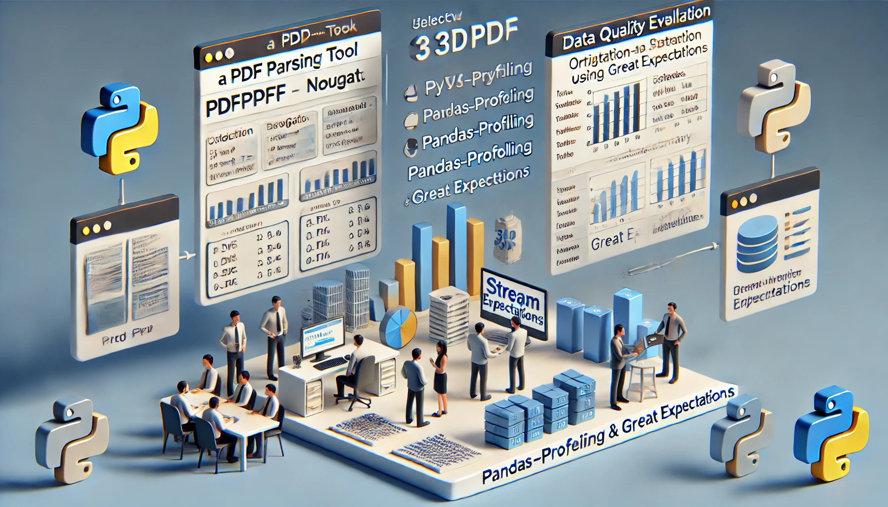

# PDF EVALUATOR USING GREAT EXPECTATIONS

[](https://streamlit.io/)
[](https://aws.amazon.com/)
[](https://www.python.org/)
[](https://pandas.pydata.org/)
[](https://cloud.google.com)
[](https://platform.openai.com/docs/api-reference/introduction)
[](https://www.postgresql.org)
[
](https://www.snowflake.com/en/?_ga=2.41504805.669293969.1706151075-1146686108.1701841103&_gac=1.160808527.1706151104.Cj0KCQiAh8OtBhCQARIsAIkWb68j5NxT6lqmHVbaGdzQYNSz7U0cfRCs-STjxZtgPcZEV-2Vs2-j8HMaAqPsEALw_wcB)

## Project Flow 

### Part 1 
The workflow for our PDF parsing tool begins with the user interacting with a Streamlit web application. The user has to upload the PDF link and has the choice to select one of two PDF parsing libraries: PyPDF or Nougat. This selection determines the underlying library used for PDF processing. The workflow branches into two distinct paths depending on the user's choice. If the user opts for "PyPDF," the tool calls the function written in Python for PDF parsing while selecting "Nougat" leads to utilizing the Nougat library for the same purpose. Once the parsing is complete, the extracted information is accessible to the user through the Streamlit interface. This final step enables the user to view the parsed PDF content and the generated summary.

### Part 2
The workflow for our Data Quality Evaluation Tool for the Freddie Mac Single-Family Dataset begins with users interacting with a Streamlit web application. Users upload a CSV or XLS file containing Freddie Mac dataset information and specify whether the data is Origination or Monthly performance data. The uploaded data is then processed using the pandas-profiling library and great expectations to provide a summary of the dataset, including statistics, data types, and data distribution, and is displayed on the streamlit dashboard.




## Project Tree 
```
📦 
├─ .DS_Store
├─ .github
│  └─ workflows
│     └─ static.yml
├─ .gitignore
├─ README.md
├─ part_1
│  ├─ .DS_Store
│  ├─ main.py
│  ├─ requirements.txt
│  ├─ workflow.py
│  ├─ workflow_diagram
│  └─ workflow_diagram.png
└─ part_2
   ├─ app.py
   ├─ great_expectations
   │  ├─ monthly.ipynb
   │  └─ orig.ipynb
   ├─ gx
   │  ├─ .gitignore
   │  ├─ checkpoints
   │  │  ├─ GX_Checkpoint.yml
   │  │  ├─ Monthly_Checkpoint.yml
   │  │  └─ my_quickstart_checkpoint.yml
   │  ├─ data
   │  │  ├─ Monthly.csv
   │  │  └─ Origination.csv
   │  ├─ expectations
   │  │  ├─ .ge_store_backend_id
   │  │  ├─ Monthly_Data_File_Suite.json
   │  │  ├─ Origination_Data_File_Suite.json
   │  │  ├─ monthly_performance.json
   │  │  ├─ origin1.json
   │  │  └─ part2.json
   │  ├─ great_expectations 2.yml
   │  ├─ great_expectations.yml
   │  ├─ plugins
   │  │  └─ custom_data_docs
   │  │     └─ styles
   │  │        └─ data_docs_custom_styles.css
   │  └─ uncommitted
   │     ├─ config_variables.yml
   │     ├─ data_docs
   │     │  └─ local_site
   │     │     ├─ expectations
   │     │     │  ├─ monthly_performance.html
   │     │     │  └─ part2.html
   │     │     ├─ index.html
   │     │     ├─ static
   │     │     │  ├─ fonts
   │     │     │  │  └─ HKGrotesk
   │     │     │  │     ├─ HKGrotesk-Bold.otf
   │     │     │  │     ├─ HKGrotesk-BoldItalic.otf
   │     │     │  │     ├─ HKGrotesk-Italic.otf
   │     │     │  │     ├─ HKGrotesk-Light.otf
   │     │     │  │     ├─ HKGrotesk-LightItalic.otf
   │     │     │  │     ├─ HKGrotesk-Medium.otf
   │     │     │  │     ├─ HKGrotesk-MediumItalic.otf
   │     │     │  │     ├─ HKGrotesk-Regular.otf
   │     │     │  │     ├─ HKGrotesk-SemiBold.otf
   │     │     │  │     └─ HKGrotesk-SemiBoldItalic.otf
   │     │     │  ├─ images
   │     │     │  │  ├─ favicon.ico
   │     │     │  │  ├─ glossary_scroller.gif
   │     │     │  │  ├─ iterative-dev-loop.png
   │     │     │  │  ├─ logo-long-vector.svg
   │     │     │  │  ├─ logo-long.png
   │     │     │  │  ├─ short-logo-vector.svg
   │     │     │  │  ├─ short-logo.png
   │     │     │  │  └─ validation_failed_unexpected_values.gif
   │     │     │  └─ styles
   │     │     │     ├─ data_docs_custom_styles_template.css
   │     │     │     └─ data_docs_default_styles.css
   │     │     └─ validations
   │     │        ├─ monthly_performance
   │     │        │  └─ Monthly_run
   │     │        │     ├─ 20231006T011054.523840Z
   │     │        │     │  └─ File2-Asset2.html
   │     │        │     └─ 20231006T014748.723102Z
   │     │        │        └─ Monthly-Asset1.html
   │     │        └─ part2
   │     │           └─ Manual_run7
   │     │              └─ 20231005T153120.852569Z
   │     │                 └─ File-Asset.html
   │     └─ validations
   │        ├─ .ge_store_backend_id
   │        ├─ monthly_performance
   │        │  └─ Monthly_run
   │        │     ├─ 20231006T011054.523840Z
   │        │     │  └─ File2-Asset2.json
   │        │     └─ 20231006T014748.723102Z
   │        │        └─ Monthly-Asset1.json
   │        └─ part2
   │           └─ Manual_run7
   │              └─ 20231005T153120.852569Z
   │                 └─ File-Asset.json
   ├─ output.csv
   ├─ output3.csv
   ├─ requirements1.txt
   ├─ streamlit
   │  └─ .streamlit
   │     ├─ bin
   │     │  ├─ Activate.ps1
   │     │  ├─ activate
   │     │  ├─ activate.csh
   │     │  ├─ activate.fish
   │     │  ├─ pip
   │     │  ├─ pip3
   │     │  ├─ pip3.11
   │     │  ├─ python
   │     │  ├─ python3
   │     │  └─ python3.11
   │     └─ pyvenv.cfg
   └─ temp
      └─ origination_data_profile_report.html
```

## License

This project is licensed under the MIT License.
